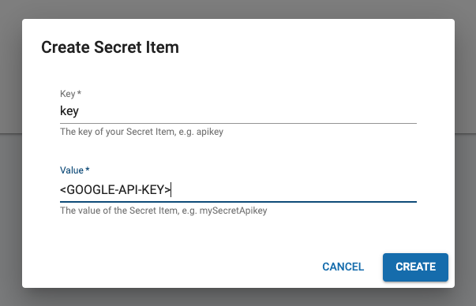

# Facebook Messenger

Use this module to perform custom Facebook Messenger functions. In order to use this, your project needs to use the [Messenger Endpoint](https://docs.cognigy.com/docs/facebook-messenger#custom-messages).

**Secret**

The **Get User Location** node requires a [Cognigy Secret](https://docs.cognigy.com/docs/secrets#using-secrets-in-a-custom-module) in order to access the [Google Geocoding API](https://developers.google.com/maps/documentation/geocoding/start). The following points show the format of the required secret:

- Secret key: 
  - "key"
- Secret value: 
  - Google API Key (Geocoding API)



---

## Get User Location

With this node you can use the Facebook location data that is sent from a user by a [pinned location message](https://www.facebook.com/help/messenger-app/583011145134913). 


The location data is forwarded to the Google Geocoding API which returns the formatted address. After executing this node, the following data object is stored to the [Cognigy Context](https://docs.cognigy.com/docs/context-object) -- the example below uses "location" as context key.

``` json
{
    "location": {
        "user": {
            "latitude": 51.12355,
            "longitude": 6.23534
        },
        "address": "Speditionstraße 1, 40221 Düsseldorf, Germany"
    }
}
```

**IMPORTANT**

**The user must send a pinned location message to the AI, otherwise the "Get User Location" node will not work and return an error message.**